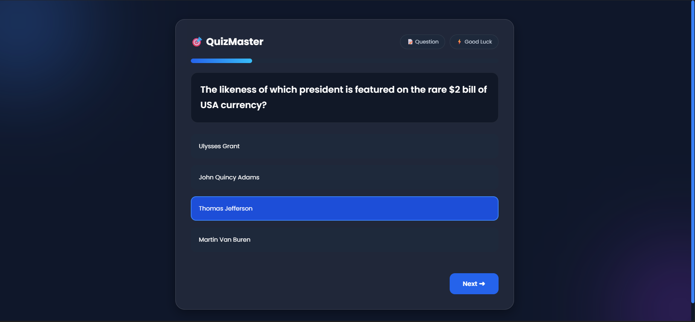
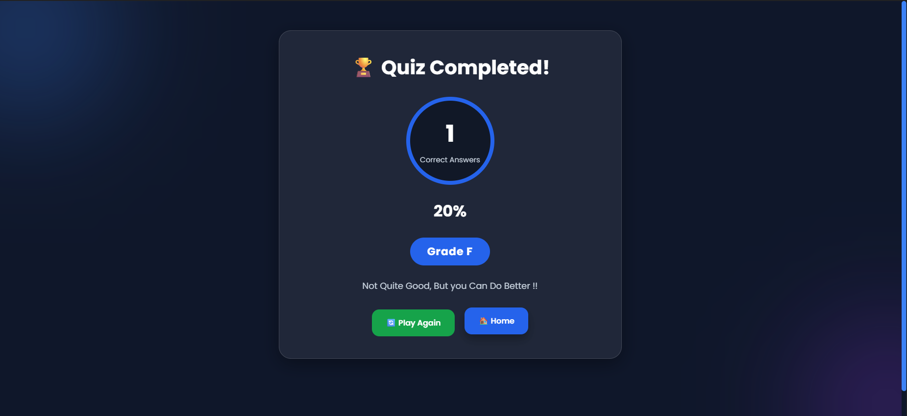

# 🎯 QuizMaster

QuizMaster is a responsive quiz application built using **Flask** and the **Open Trivia Database API**. Users can customize the quiz by selecting the number of questions, category, difficulty, and question type.

---

## ✨ Features

* 🌐 Fetches live quiz questions using the Open Trivia DB API
* 🎯 Multiple categories
* 📊 Difficulty selection (Easy / Medium / Hard)
* ❓ Multiple Choice & True/False questions
* 📈 Progress Bar
* 🧠 Score Calculation
* 🏆 Grade & Percentage
* 💾 Session Management
* 📱 Responsive UI
* 🌙 Modern Dark Theme

---

## 🛠 Tech Stack

* Python
* Flask
* HTML5
* CSS3
* Jinja2
* Open Trivia Database API

---

## 📁 Project Structure

```
QuizMaster/
│
├── static/
│   └── style.css
│
├── templates/
│   ├── index.html
│   ├── quiz.html
│   └── result.html
│
├── app.py
├── requirements.txt
└── README.md
```

---

## 🚀 Installation

```bash
git clone https://github.com/yourusername/QuizMaster.git

cd QuizMaster

pip install -r requirements.txt

python app.py
```

Open your browser and visit:

```
http://127.0.0.1:5000
```

---

## 📸 Screenshots

### 🏠 Home Page


---

### ❓ Quiz Page



---

### 🏆 Result Page



## 🎯 Future Improvements

* Timer for each question
* Leaderboard
* User Authentication
* Randomized Answer Order
* Review Incorrect Answers
* Save Quiz History

---

## 👨‍💻 Author

Made with ❤️ by **ASHUTOSH SHIOORKAR**
